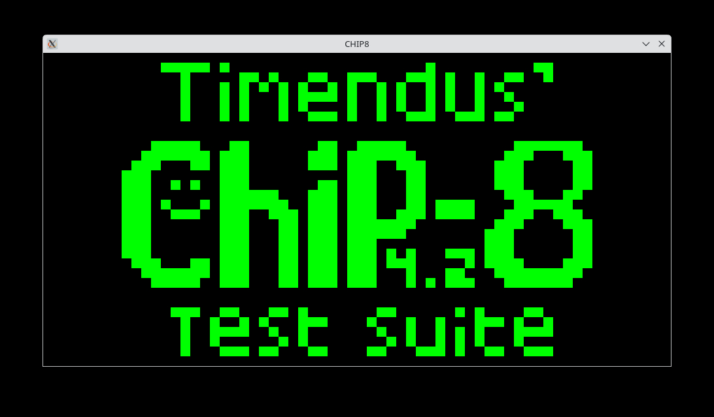
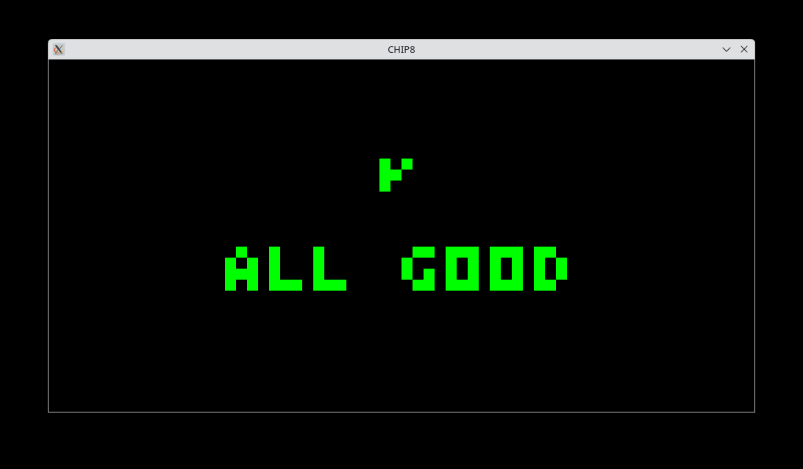

# CHIP-8
CHIP8 is an interpreted language which was used for making DIY Games back in the early 70s and late 60s. Emulating the system is always a fun thing to do when you are bored or trying to learn a new language

My Implementation of CHIP8 is not really that good but it works and has passed most of the tests I found online.

--- 

## Screenshots




---
## Notes
- This has been tested in Linux (Debian).
- I have tested 10 sample ROMs. They seem to be all working.
- There are some instructions which are not correctly interpreted by the CPU.

----
## References
- Cowgod's CHIP-8 Technical References
http://devernay.free.fr/hacks/chip8/C8TECH10.HTM

- Timendus' CHIP-8 Test Suite
https://github.com/Timendus/chip8-test-suite

> These are life saver, I would encourage to use Timendus' tests to verify whether instructions are correctly being interpreted or not.

-----

```diff
- Note: There are some instructions which differ from implementations and sources but they don't matter that much. 
```

------

## Building Requirements:
1. SDL2 is needed since graphics depends upon it.
2. Use any C compiler. [Change the `CC` variable in `Makefile` to match your compiler and also  flags if needed, defaults to GCC].
3. Use makefile to build executable.

```bash
# in the main project folder
make
```

#### Run the emulator
```bash

./chip8 roms/6-keypad.ch8
```

> Other ROMs can be found in the internet through a simple google search.

----

## TODO:
- [ ] Improve Instruction Handeling
- [ ] Timing issues still persists, have to fix them.
- [ ] Improve codes, since there are many loop holes.
